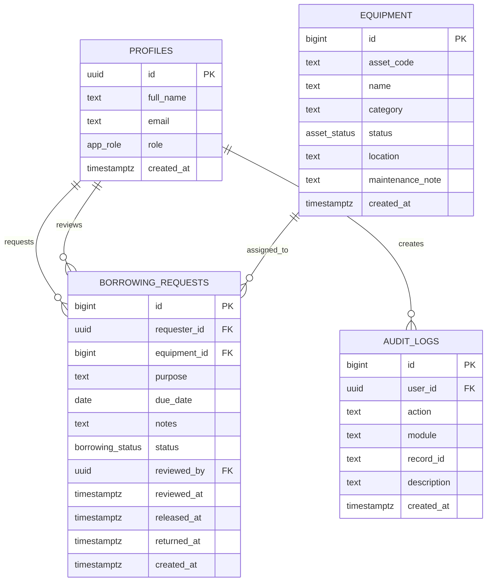
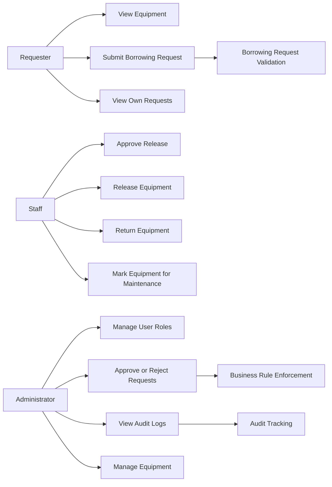
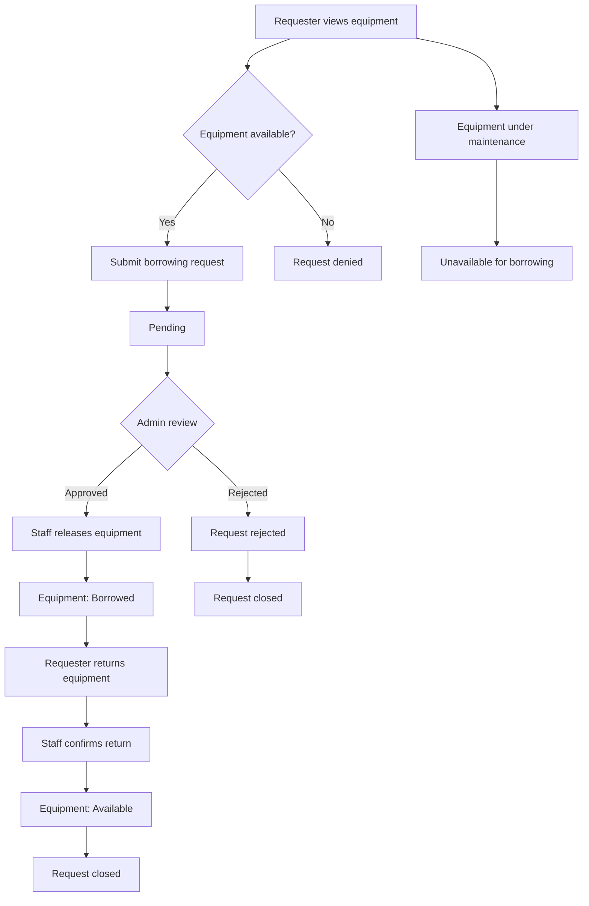

# AssetFlow – Asset Borrowing and Equipment Management System

## 1. Project Overview

AssetFlow is a web-based asset management system designed for tracking equipment availability, managing borrowing requests, and enforcing role-based access control. The system supports three user roles:

- Requester
- Staff
- Administrator

The platform allows users to:
- view equipment inventory,
- submit borrowing requests,
- track request status,
- release and return items,
- place equipment under maintenance,
- maintain audit records for accountability.

---

## 2. Updated ERD

### ERD Explanation
- A profile can create many borrowing requests.
- One equipment item can be referenced by many borrowing requests.
- One profile can review many requests.
- Each action is logged in the audit table for traceability and compliance.

---

## 3. Use Case Diagram

### Use Cases
- Requester can browse available equipment and submit a borrowing request.
- Staff can release items to borrowers and process returned items.
- Administrator has full system control and monitoring rights.
- All actions are validated and recorded in the audit log.

---

## 4. Role-Permission Matrix

| Role | View Equipment | Create Borrow Request | Approve/Reject Request | Release Equipment | Return Equipment | Mark Maintenance | Update User Role | View Audit Log |
|------|----------------|----------------------|------------------------|------------------|------------------|------------------|-----------------|----------------|
| Requester | Yes | Yes, only own request | No | No | No | No | No | No |
| Staff | Yes | Yes | No | Yes | Yes | Yes | No | No |
| Administrator | Yes | Yes | Yes | Yes | Yes | Yes | Yes | Yes |

### Access Rules
- Requesters can only create borrowing requests for themselves.
- Staff can manage borrowing transactions and maintenance status.
- Administrators are the only users allowed to approve/reject requests and change user roles.
- Audit logs are restricted to administrators.

---

## 5. Workflow Diagram

### Workflow Summary
1. User checks equipment availability.
2. Requester submits a request.
3. Administrator approves or rejects the request.
4. Staff releases borrowed equipment.
5. Staff records return and equipment becomes available again.
6. Maintenance items remain unavailable until reset.

---

## 6. Business Rules

1. Equipment must be in Available status before a request can be submitted.
2. Maintenance items cannot be borrowed.
3. Users can only create borrowing requests for themselves unless they are administrators.
4. Only administrators can approve or reject requests.
5. A user cannot approve their own request.
6. Only Approved requests can be released.
7. Only Released requests can be returned.
8. Once equipment is returned, its status changes back to Available.
9. Staff and administrators can process equipment release and return actions.
10. All critical actions are recorded in the audit log.
11. Role updates are restricted to administrators.
12. Audit logs and role actions are protected by row-level security.

---

## 7. Audit-Log Screenshot

---

## 8. Functional Test Results

### Test Summary
- Total test cases: 10
- Status: 10 passed
- Result: Fully functional and ready for submission

| Test ID | Test Case | Expected Result | Result |
|---------|-----------|-----------------|--------|
| TC-01 | User registration and profile creation | New user profile is created automatically | Pass |
| TC-02 | Request available equipment | Request is accepted and stored | Pass |
| TC-03 | Request unavailable equipment | System rejects the request | Pass |
| TC-04 | Admin approves borrowing request | Request status becomes Approved | Pass |
| TC-05 | Staff releases equipment | Status becomes Released and equipment becomes Borrowed | Pass |
| TC-06 | Staff returns equipment | Status becomes Returned and equipment becomes Available | Pass |
| TC-07 | Equipment maintenance action | Equipment moves to Maintenance and becomes unavailable | Pass |
| TC-08 | Role update | Administrator updates user role successfully | Pass |
| TC-09 | Audit log generation | Action is written to audit log | Pass |
| TC-10 | Access restriction / RLS | Unauthorized users cannot change sensitive data | Pass |

### Conclusion
AssetFlow satisfies the required borrowing workflow, role-based authorization, and audit logging requirements. The system is operational, secure, and aligned with the structured database rules defined in the project schema.

---

## 9. Final Notes

This documentation reflects the current database design and application behavior implemented in AssetFlow. The system is suitable for academic submission and demonstrates:
- normalized data design,
- controlled business logic,
- secure role enforcement,
- traceable audit logging,
- practical workflow management.
